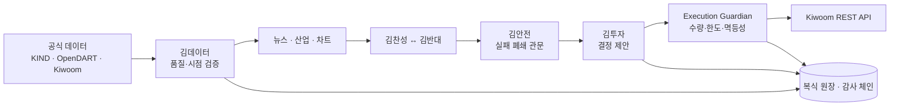

<div align="center">
  
  <h1>MoneyGun</h1>
  <p><strong>가상 직원들이 조사하고, 토론하고, 위험을 검증하는 개인용 AI 투자회사 운영 시스템</strong></p>
  <p>Deterministic multi-agent research and fail-closed trading operations for a single owner.</p>

  [](https://github.com/hoya0328/MoneyGun/actions/workflows/ci.yml)
  
  
  
  
</div>

> [!WARNING]
> MoneyGun은 개인 연구·자동화 프로젝트이며 투자 자문이나 수익 보장 서비스가 아닙니다.
> 실제 거래 기능은 기본적으로 꺼져 있고, 원금 전액 손실 가능성이 있습니다. 저장소에는
> API 키, 계좌 식별자, 주문 기록과 실제 시장 데이터가 포함되지 않습니다.

## 프로젝트 한눈에 보기

MoneyGun은 하나의 예측 모델이 바로 주문하는 봇이 아닙니다. 데이터, 뉴스, 차트, 찬반 토론,
위험 심사, 포트폴리오 결정과 주문 실행을 서로 다른 역할로 분리하고 모든 결정을 감사 가능한
기록으로 남깁니다. 귀여운 픽셀 오피스는 복잡한 자동화 상태를 직관적으로 보여 주는 인터페이스입니다.

<p align="center">
  
</p>

## 가상 투자회사 팀

| 직원 | 담당 | 주문 권한 |
|---|---|---:|
| 김데이터 | 공식 시세·종목·시장조치 검증과 일일 갱신 | 없음 |
| 김뉴스 | OpenDART 공시 감시와 위험 공시 BUY 차단 | 없음 |
| 김산업 | 산업·공급망 근거 정리 | 없음 |
| 김차트 | 추세·모멘텀·유동성 신호 계산 | 없음 |
| 김찬성 / 김반대 | 상승 논리와 반대 논리의 구조화된 토론 | 없음 |
| 김안전 | 자본·손실·신선도·대사 관문과 거부권 | 없음 |
| 김투자 | 근거를 종합해 BUY/HOLD/SELL 제안 | 없음 |
| 김주문 | 단일 Execution Guardian을 통한 승인·주문·체결·대사 | 제한적 단독 소유 |

LLM 역할은 조사와 설명에만 참여합니다. 주문 수량, 손실 한도와 제출 여부는 결정론적 코드가 계산하며
Execution Guardian 외의 컴포넌트는 브로커 주문 능력을 갖지 않습니다.

## 운용 모드

| 모드 | 아이디어 | 기본 실행 구간 |
|---|---|---|
| 집중투자 | 전시장 추세·상대강도 기반 소수 후보 | 다음 장 지정가 |
| 종가매매 | 확정 신호와 종가 단일가 구간 활용 | 장 마감 전 |
| 장초 단타 | 첫 10분 범위 돌파와 추적 청산 | 09:10~11:00 |
| 안전투자 | 대형·고유동성·저변동성 필터 | 중기 |
| 장기투자 | 장기 추세와 낮은 회전율 | 장기 |

모든 모드는 하나의 격리 자본 원장, 동시 보유 한도, 일일 손실선, 뉴스 차단, 킬 스위치와
기존 외부 보유분 제외 규칙을 공유합니다.

## 아키텍처



- `apps/web`: React + TypeScript 기반 반응형 픽셀 오피스
- `apps/api`: FastAPI 기반 연구, 데이터 자격, 전략, 위험, 원장과 실행 경계
- `SQLite`: 로컬 단일 소유자 운영 원장과 불변 감사 기록
- `Windows supervisor`: 로그인 자동 시작, 복구 대사, 다중 스케줄러와 로컬 전용 운영

자세한 경계는 [아키텍처 문서](docs/ARCHITECTURE.md)와
[운용 모드 문서](docs/MODE_PROFILES.md)에서 확인할 수 있습니다.

## 안전 설계

- 실제 주문 기능은 저장소 기본값에서 비활성화
- 시장가·신용·미수·공매도·파생상품 금지
- 오래된 시세, 공시 감시 지연, 계좌 대사 차이, 불명확한 브로커 응답은 즉시 실패 폐쇄
- `UNKNOWN` 주문은 자동 재시도하지 않고 대사 후에만 다음 상태로 이동
- 데이터 스냅샷, 전략, 결정, 주문, 체결과 감사 이벤트는 버전형·추가형으로 저장
- 브로커 키와 소유자 승인 토큰은 Git이 아닌 Windows DPAPI 경계에 저장

## 로컬 실행

필수 환경은 Node.js 24+, Python 3.13+입니다.

```powershell
git clone https://github.com/hoya0328/MoneyGun.git
Set-Location MoneyGun
npm install
python -m venv .venv
.\.venv\Scripts\python.exe -m pip install -e "apps/api[dev]"
Copy-Item .env.example .env
.\scripts\start-local.ps1
```

Vite가 출력하는 로컬 주소를 브라우저에서 열면 됩니다. `.env.example`은 이름과 안전한 기본값만
제공하며, 실제 자격증명은 절대 커밋하지 마세요.

### 검증

```powershell
.\.venv\Scripts\python.exe -m ruff check apps/api/src apps/api/tests
.\.venv\Scripts\python.exe -m pytest apps/api/tests -q
npm run typecheck
npm run build
```

GitHub Actions도 같은 핵심 관문을 pull request마다 실행합니다.

## 프로젝트 구조

```text
MoneyGun/
├─ apps/
│  ├─ api/                 # FastAPI 도메인·전략·실행 경계
│  └─ web/                 # React 픽셀 오피스
├─ docs/                   # 제품·아키텍처·전략·운영 문서
├─ scripts/                # 로컬 실행·검사·복구 스크립트
├─ AGENTS.md               # 프로젝트 개발 원칙
└─ MoneyGun.code-workspace
```

## 더 읽기

- [사용 가이드](docs/USER_GUIDE.md)
- [프로젝트 컨텍스트](docs/PROJECT_CONTEXT.md)
- [위험 위임 규칙](docs/RISK_MANDATE.md)
- [종가매매 전략](docs/CLOSE_AUCTION_STRATEGY.md)
- [장초 단타 전략](docs/OPENING_RANGE_STRATEGY.md)
- [공식 데이터 자격](docs/DATA_QUALIFICATION.md)
- [비주얼 시스템](docs/ART_BIBLE.md)

## 현재 상태와 로드맵

한국 주식 로컬 단일 소유자 프로토타입, 공식 데이터 갱신, 다섯 운용 모드, 공시 감시,
실행 안전장치와 복구 대사까지 구현되어 있습니다. 다음 큰 단계는 장기간의 실운영 증거 축적,
전략별 OOS 개선, 미국 주식 데이터·브로커 경계와 원격 관측성입니다.

진행 항목은 [ROADMAP](docs/ROADMAP.md)을 참고하세요.

## 기여와 보안

기여 전 [CONTRIBUTING.md](CONTRIBUTING.md)를 읽어 주세요. 취약점이나 자격증명 노출 가능성은
공개 이슈에 값을 붙이지 말고 [SECURITY.md](SECURITY.md)의 절차를 따라 주세요.

이 저장소는 포트폴리오 열람을 위해 공개됩니다. 별도 라이선스가 명시되지 않은 소스의 사용·복제·배포
권한은 자동으로 부여되지 않습니다. © 2026 MoneyGun. All rights reserved.
