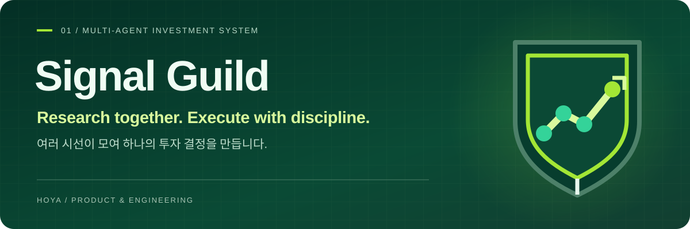
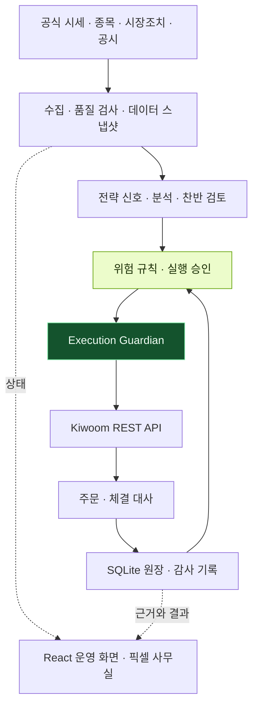

<p align="center">
  
</p>

<p align="center">
  
</p>

<p align="center">
  <a href="https://github.com/hoya0328/MoneyGun/actions/workflows/ci.yml"></a>
  
  
  
</p>

# MoneyGun

**분석부터 위험 검토, 주문과 복구까지. 개인용 투자 자동화를 작은 회사의 형태로 풀어낸 프로젝트입니다.**

[사용 가이드](docs/USER_GUIDE.md) · [아키텍처](docs/ARCHITECTURE.md) · [운용 모드](docs/MODE_PROFILES.md) · [로드맵](docs/ROADMAP.md)

## 프로젝트를 시작한 이유

자동매매를 직접 사용하려면 수익률보다 먼저 이해해야 할 것이 있다고 생각했습니다. 어떤 자료를 보고 종목을 골랐는지, 왜 매수를 보류했는지, 프로그램이 중단됐다가 돌아왔을 때 주문이 중복되지 않는지를 확인할 수 있어야 했습니다.

MoneyGun은 이 과정을 공시·차트·찬반 검토·위험 관리·주문 담당으로 나눕니다. 각 역할을 귀여운 픽셀 직원으로 표현하되, 실제 거래 권한은 별도의 실행 계층에 두었습니다. **보기 쉬운 화면과 보수적인 실행 구조를 함께 만드는 것**이 이 프로젝트의 중심입니다.

소규모 자본으로 시작하는 개인용 실험이며, 한국 주식을 우선 대상으로 합니다. 특정 수익을 약속하거나 검증되지 않은 전략을 완성된 투자 상품처럼 제공하려는 프로젝트는 아닙니다.

## 복잡한 상태를 읽기 쉬운 사무실로

<p align="center">
  
  <br />
  <sub>프로젝트의 픽셀 사무실 아트입니다. 실계좌 화면이나 투자 성과 자료가 아닙니다.</sub>
</p>

직원 사무실에서는 역할을, 운영 화면에서는 데이터 준비 상태와 판단 근거, 주문 차단 사유를 확인하도록 구성했습니다. 친숙한 이름을 쓰더라도 실제로 어떤 데이터와 규칙이 동작하는지는 구분해 설명합니다.

| 직원 | 담당하는 역할과 구현 경계 |
| :--- | :--- |
| **김데이터** | 공식 시세·종목·시장조치 데이터를 수집하고 기준일과 품질을 확인합니다. |
| **김뉴스** | 현재 구현의 중심은 **OpenDART 공시 감시와 위험 공시 기반 매수 차단**입니다. 모든 언론 뉴스를 실시간으로 분석하는 서비스는 아닙니다. |
| **김산업** | 산업과 관련 맥락을 정리하는 분석 역할입니다. |
| **김차트** | 추세·거래량·변동성 등 전략에 필요한 신호를 확인합니다. |
| **김찬성 · 김반대** | 매수 근거와 반대 근거를 나누어 검토하는 역할입니다. |
| **김안전** | 자본·손실·보유 한도, 데이터 신선도와 계좌 대사 상태를 검사합니다. |
| **김투자** | 분석 결과를 매수·보유·매도 판단으로 연결합니다. |
| **김주문** | 실행 보호 계층을 통해 승인된 주문을 전달하고 주문·체결 상태를 대조합니다. |

직원은 제품의 역할 모델입니다. 모든 직원이 독립된 LLM으로 상시 실행된다는 의미는 아닙니다. AI가 연구와 설명을 보조할 수 있지만, 주문 수량·위험 한도·실행 가능 여부는 결정적인 코드와 정책으로 판정합니다.

## 다섯 가지 운용 모드

| 모드 | 설계 방향 |
| :--- | :--- |
| **집중투자** | 조건을 충족하는 소수 후보에 집중하되, 운용 자본과 보유 한도를 적용합니다. |
| **종가매매** | 장 마감 전 신호와 유동성을 확인하고 종가 구간의 진입·청산 규칙을 적용합니다. |
| **장초단타** | 개장 직후 관찰 구간을 거친 뒤 돌파·거래량 신호와 장중 청산 규칙을 사용합니다. |
| **안전투자** | 유동성과 변동성 조건을 더 보수적으로 설정합니다. 이름과 달리 손실이 없는 모드는 아닙니다. |
| **장기투자** | 긴 추세와 낮은 회전율을 중심으로 운용합니다. |

모드가 바뀌어도 기존 보유종목 제외, 위험 공시 차단, 손실 한도, 긴급 정지 같은 공통 제약은 유지합니다. 실행 시간과 구체적인 수치는 [모드 프로필](docs/MODE_PROFILES.md), [종가 전략](docs/CLOSE_AUCTION_STRATEGY.md), [장초 전략](docs/OPENING_RANGE_STRATEGY.md)에 따로 기록했습니다.

## 설계에서 중요하게 다룬 점

### 1. 분석과 주문 권한을 분리했습니다

좋아 보이는 분석이 곧 주문 허가가 되지 않도록 했습니다. 분석 결과는 전략·위험 검사와 실행 승인을 거치며, 증권사 세션과 주문 권한은 **Execution Guardian**만 소유합니다.

### 2. 불확실한 상태를 정상으로 가정하지 않습니다

증권사 응답이 불명확한 주문은 `UNKNOWN`으로 남기고, 계좌·주문·체결 기록을 대조한 뒤 다음 동작을 결정합니다. 무조건 재시도해 중복 주문을 만드는 상황을 피하도록 설계했습니다. 시세가 오래됐거나 대사에 차이가 있으면 새 주문을 차단합니다.

### 3. 규칙이 바뀌어도 과거 판단을 추적할 수 있게 했습니다

운용 자본, 모드, 전략, 판단, 주문, 체결과 감사 기록을 버전이 있는 데이터로 관리합니다. 자동 갱신 데이터도 검증을 통과한 스냅샷만 활성화해, 이후 어떤 자료로 판단했는지 확인할 수 있게 했습니다.

## 시스템 구조



| 영역 | 사용 기술과 책임 |
| :--- | :--- |
| 화면 | React · TypeScript · Vite 기반 PWA, 직원과 운영 상태를 표시합니다. |
| API·전략 | Python · FastAPI, 전략 신호와 위험 규칙을 계산합니다. |
| 저장 | SQLite, 판단·주문·체결·감사 이력을 보관합니다. |
| 외부 연동 | Kiwoom REST API, OpenDART, 공공 데이터와 KIND 시장조치 자료를 사용합니다. |
| 로컬 운영 | Windows 실행 스크립트, 상태 감시, 일일 데이터 갱신과 재기동 복구를 제공합니다. |
| 검증 | GitHub Actions에서 웹 타입·빌드와 API 정적 검사·테스트를 수행합니다. |

## 구현 상태와 다음 과제

**구현한 범위:** 공식 데이터 일일 갱신, 공시 위험 감시, 다섯 운용 모드, 주문 전 검사, 기존 보유종목 제외, 주문·체결 기록과 재시작 복구 흐름입니다.

**계속 검증할 범위:** 운용 기록 축적, 전략의 표본 외 검증, 실제 거래 비용을 반영한 성능 평가와 장애 상황에서의 복구 품질입니다. 미국 주식 확장은 후속 범위입니다.

코드의 구현 여부와 특정 계좌의 실거래 자격은 다릅니다. 공개 저장소를 실행하는 것만으로 실주문이 활성화되지 않으며, 계정 설정·데이터 자격·릴리스 점검·소유자 승인이 별도로 필요합니다.

<details>
<summary><strong>로컬 실행과 검증</strong></summary>

### 준비 환경

Windows 로컬 실행 기준으로 Node.js 24와 Python 3.13을 사용합니다. 아래 명령은 PowerShell 기준입니다.

```powershell
git clone https://github.com/hoya0328/MoneyGun.git
Set-Location MoneyGun
npm install
python -m venv .venv
.\.venv\Scripts\python.exe -m pip install -e "apps/api[dev]"
Copy-Item .env.example .env
.\scripts\start-local.ps1
```

공개 기본값인 `KIWOOM_TRADING_ENABLED=false`를 유지해 시작하세요. 키와 계좌 정보는 Git에 넣지 않으며, 실거래 설정은 [사용 가이드](docs/USER_GUIDE.md)와 [활성화 체크리스트](docs/ACTIVATION_CHECKLIST.md)를 따릅니다.

### 주요 검사

```powershell
npm run typecheck
npm run build
.\.venv\Scripts\python.exe -m ruff check apps/api/src apps/api/tests
.\.venv\Scripts\python.exe -m pytest apps/api/tests -q
```

Windows 커널 뮤텍스 통합 검사는 Windows 환경에서 확인하며, Linux CI에서는 해당 검사를 명시적으로 건너뜁니다.

</details>

## 문서 안내

| 궁금한 내용 | 문서 |
| :--- | :--- |
| 사용 방법과 운영 중 확인할 사항 | [사용 가이드](docs/USER_GUIDE.md) · [운영 절차](docs/OPERATIONS_RUNBOOK.md) |
| 구조와 의사결정의 배경 | [아키텍처](docs/ARCHITECTURE.md) · [설계 결정](docs/DECISIONS.md) |
| 데이터와 위험 관리 기준 | [데이터 자격](docs/DATA_QUALIFICATION.md) · [위험 한도](docs/RISK_MANDATE.md) |
| 다음 개발과 검증 범위 | [로드맵](docs/ROADMAP.md) · [인수인계](docs/HANDOFF.md) |

> 개인용 투자 자동화 연구 프로젝트입니다. 투자 조언이나 수익 보장이 아니며, 원금 전액을 잃을 수 있습니다. 신용·레버리지·공매도·파생상품은 기본 범위에 포함하지 않습니다.

---

[기여 안내](CONTRIBUTING.md) · [보안 제보](SECURITY.md) · [HOYA의 다른 프로젝트](https://github.com/hoya0328)
