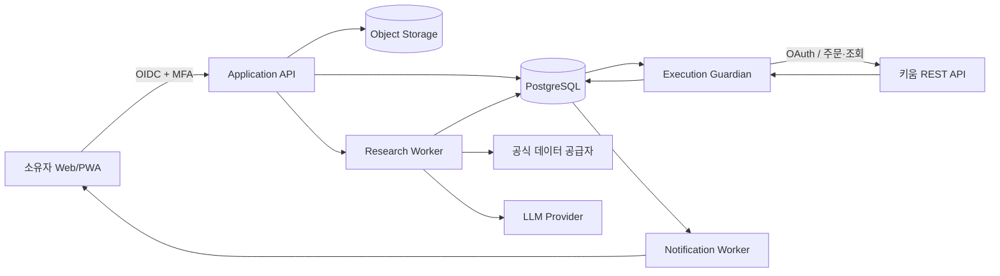

# Signal Guild 서비스 아키텍처

최종 갱신: 2026-09-07
상태: 구현 가능한 MVP 설계 v0.3

> 리브랜딩 호환 경계: 화면과 공개 문서의 제품명은 `Signal Guild`를 사용한다. 이미 운영 중인
> `MONEYGUN_*` 환경변수, `moneygun_api` 모듈, DB·백업 파일명, Windows 예약 작업과 뮤텍스
> 식별자는 안전한 별도 마이그레이션 전까지 유지한다. 브랜드 변경은 주문 권한이나 전략 버전을
> 변경하지 않는다.

## 1. 설계 범위

### 확정 요구사항

- 사용자 1명의 자기자금만 운용하는 비공개 서비스
- 초기 시장은 한국 주식, 증권사는 키움증권 REST API
- 초기 상품은 10만 원 독립 자본의 집중투자 미션
- 가상 직원이 독립 조사·찬반 토론·위험 검토·결정·감사를 수행
- 연구와 그림자 운용을 거쳐 승인형·자율형 실주문까지 지원
- 집중투자, 안전투자, 장기투자를 버전형 모드로 확장
- 데스크톱은 연구·설정, 모바일은 승인·감시·중지를 우선
- LLM은 숫자 계산, 수량 결정, 주문 전송 권한을 갖지 않음

### 설계 가정

- 초기에는 하나의 키움 계좌와 하나의 한국 시장 세션만 사용한다.
- 실거래용으로 별도 계좌를 쓰는 것을 권장하되 가능 여부는 계좌 확인 단계에서 확정한다.
- 실시간 뉴스 유료 공급자가 없어도 DART·가격·거래량으로 핵심 흐름이 작동한다.
- L0 5만 원 파일럿은 외부 서버 없이 소유자의 Windows PC를 단일 전용 호스트로 사용한다.
- 클라우드 배포는 원격 접속·다중 장치·L2 무인운용·가용성 요구가 생길 때 후속 검토한다.
- 10만 원→1,000만 원은 보장 목표가 아니라 미션 진행률이다.

### 이번 설계의 비범위

- 미국 주식 세부 주문 API, 환전 구현
- 안전투자·장기투자 전략 구현
- 공개 회원가입, 결제, 타인 계좌 연결
- 고빈도·분봉 초단타, 파생상품, 신용·공매도
- 특정 클라우드 사업자와 LLM 공급자 확정

## 2. 상위 구조



MVP는 마이크로서비스가 아니라 하나의 저장소와 공통 도메인 모델을 쓰는 **프로세스 분리형 모듈러 모놀리스**다. 연구 장애가 주문 실행을 멈추게 하거나, UI 장애가 위험축소를 막지 않도록 실행 프로세스만 별도로 격리한다.

## 3. 실행 프로세스와 책임

| 구성요소 | 책임 | 운영 소유자 | 실패 시 기본 행동 |
|---|---|---|---|
| Web/PWA | 대시보드, 미션 설정, 보고서, 승인, 킬 스위치 | 제품 UI | 읽기 실패 표시, 주문 상태 추정 금지 |
| Application API | 인증, 명령 검증, 조회 모델, 승인·모드·미션 관리 | Core | 쓰기 거부, 기존 실행 워커와 독립 |
| Research Worker | 데이터 스냅샷, 스캐너, 에이전트 협업, 주문 제안 | DATA·ACE | 신규 매수 제안 없음 |
| Strategy Engine | 특징·점수·무효화·포지션 크기 계산 | PULSE | 계산 불가 후보 제외 |
| Risk Engine | 계좌·미션·모드·단계 한도와 거부권 | RISK | 불확실하면 거부 |
| Execution Guardian | 단일 키움 세션, 주문 전 검사, 제출, 체결 수집, 대사 | OPS·GUARDIAN | 신규 주문 차단, 상태 조회 우선 |
| Audit Engine | 모든 입력·결정·승인·주문·변경의 불변 계보 | AUDIT | 기록 실패 시 신규 주문 차단 |
| Notification Worker | 승인 요청, 체결, 손실, 장애, 재개 알림 | GUARDIAN | 인앱 경고 유지, 중요 알림 재시도 |
| PostgreSQL | 거래 원장, 상태 머신, 명령·이벤트·작업 큐 | Core | 연결 실패 시 주문 금지 |
| Object Storage | 원 공시, 보고서, 백테스트 산출물, 큰 스냅샷 | DATA·AUDIT | 새 근거 생성 중지, 기존 주문 영향 없음 |

## 4. 사용자 흐름

### 4.1 최초 설정

1. 소유자가 패스키 또는 MFA로 로그인한다.
2. 서비스가 `10만 원 집중투자 미션` 기본안을 보여준다.
3. 소유자가 최대 손실 가능성, 자동 추가입금 금지, -30% 중지선을 확인한다.
4. 키움 계좌는 처음에 읽기 전용으로 연결한다.
5. 내부 잔고와 키움 잔고가 일치하면 R1 그림자 운용을 시작한다.
6. R1 게이트와 릴리스 점검 후 소유자가 L1 실거래를 다시 인증해 활성화한다.

성공 상태: 미션, 모드 버전, 전략 버전, 자본 원장, 계좌 연결과 승인 기록이 하나의 감사 체인으로 연결된다.

실패 상태: 계좌 자격·잔고·약관·API 등록 중 하나라도 확인되지 않으면 연구 모드만 허용한다.

### 4.2 매일의 투자위원회

1. DATA가 장 종료 후 가격·거래량·DART·이벤트 스냅샷을 닫는다.
2. PULSE·SERENITY·NOVA가 같은 스냅샷을 독립 분석한다.
3. BULL과 BEAR가 후보별 상승 논리, 반증, 무효화 조건을 제출한다.
4. ACE가 목표 종목·수량이 아닌 `목표 비중 제안`을 만든다.
5. Strategy Engine이 점수·진입가·무효화·계획 위험을 계산한다.
6. Risk Engine이 모드·단계·미션·계좌 한도를 합쳐 승인·축소·거부한다.
7. OPS가 `OrderIntent`를 만들고 L1이면 사용자 승인 대기, L2면 자동 승인 큐로 보낸다.
8. 다음 거래일 Execution Guardian이 최신 호가·잔고로 다시 검사하고 주문한다.
9. 체결 후 즉시 대사하고 AUDIT가 전체 의사결정 계보를 고정한다.

필수 에이전트 보고서가 하나라도 없거나 증거가 오래되면 신규 매수는 만들지 않는다. 기존 위험축소와 계좌 대사는 계속된다.

### 4.3 L1 매수 승인

- 모바일 알림은 종목, 금액, 미션 자본 비중, 최악 계획손실, 상승 논리 3개, BEAR 핵심 반론, 무효화 가격, 승인 만료시각을 한 화면에 표시한다.
- `승인`, `거부`, `오늘 신규매수 중지` 세 행동만 제공한다.
- 승인은 생체인증 또는 패스키 재확인을 요구한다.
- 승인은 해당 주문계획 버전과 가격 범위에만 유효하다. 가격·수량·근거가 바뀌면 재승인한다.
- 만료 전 응답이 없으면 자동 거부한다.

### 4.4 킬 스위치

- 어느 화면에서나 두 번의 명확한 동작으로 활성화한다.
- 활성화 즉시 신규·정정 주문을 막고 미체결 신규매수는 취소한다.
- 보유 포지션을 즉시 전량 시장가로 팔지는 않는다.
- RISK가 유동성·가격 보호를 반영한 위험축소 계획을 만들고 사용자에게 보여준다.
- 재개에는 장애 원인, 대사 성공, 새 상태 스냅샷과 MFA 재승인이 필요하다.

## 5. 상태 모델

### 투자 미션

`DRAFT → RESEARCH → SHADOW → APPROVAL_LIVE → AUTONOMOUS → PAUSED → CLOSED`

- `PAUSED`에서는 신규 매수 금지, 위험축소·대사 허용
- `CLOSED`는 재개할 수 없고 새 미션을 생성해야 함
- 권한 단계 승격은 새 `MandateVersion`을 생성

### 투자위원회 결정

`COLLECTING → DEBATING → PROPOSED → RISK_REVIEWED → APPROVED | REJECTED → ORDER_PLANNED → COMPLETE`

- 입력 스냅샷이 바뀌면 기존 결정을 수정하지 않고 새 결정 버전을 생성
- `RISK_REVIEWED`의 거부는 ACE나 사용자가 우회할 수 없음

### 주문

`CREATED → PRECHECKED → AWAITING_APPROVAL → READY → SUBMITTING → ACKNOWLEDGED → PARTIALLY_FILLED → FILLED`

종료 상태: `CANCELLED`, `REJECTED`, `EXPIRED`, `FAILED`, `UNKNOWN`

- 네트워크 시간 초과는 `FAILED`가 아니라 `UNKNOWN`
- `UNKNOWN`은 키움 주문 조회와 대사가 끝나기 전 동일 주문을 재제출하지 않음
- 주문 상태는 키움 접수번호와 내부 멱등 키를 모두 보유

## 6. 핵심 데이터 모델

| 엔터티 | 핵심 필드 | 소유·변경 규칙 | 보존 |
|---|---|---|---|
| `User` | id, auth_subject, locale, timezone | 소유자 1명 | 계정 수명 |
| `BrokerAccount` | broker, masked_account, capabilities, status | 자격증명은 별도 SecretRef | 연결 해제 후 10년 |
| `ModeProfile` | code, version, limits, strategy_allowlist | 승인 후 불변 | 영구 |
| `Mission` | mode_version, seed_capital, goal, stage, state | 자본 이동은 승인 필요 | 영구 |
| `CapitalLedger` | mission_id, available, reserved_profit, exposed, realized | 복식 원장, 직접 수정 금지 | 10년 이상 |
| `MandateVersion` | stage, limits, valid_from, approved_by | 소급 변경 금지 | 영구 |
| `StrategyVersion` | rules_hash, feature_schema, code_commit | 운영 중 수정 금지 | 영구 |
| `Instrument` | market, symbol, ISIN, status, sector | 시점별 식별자 이력 | 영구 |
| `MarketSnapshot` | as_of, source, checksum, quality, qualification_manifest | 닫힌 뒤 불변; 생존편향·지정상태 자격은 검증기가 도출 | 원본 5년 이상 |
| `Evidence` | source_uri, published_at, fetched_at, checksum | 정정은 새 버전 | 10년 |
| `AgentRun` | role, model, prompt_version, input_hash, status | 원 출력과 구조화 출력 분리 | 2년/요약 10년 |
| `ResearchReport` | thesis, claims, evidence_ids, confidence | 근거 없는 수치 금지 | 10년 |
| `CommitteeDecision` | action, target_weight, invalidation, version | 이전 결정 덮어쓰기 금지 | 10년 |
| `RiskVerdict` | limits, calculated_risk, result, reasons | Risk Engine만 생성 | 10년 |
| `OrderIntent` | decision_id, side, qty_rule, price_band, idempotency_key | 브로커 주문과 1:N | 10년 |
| `BrokerOrder` | broker_order_id, state, timestamps | 키움 응답 기반 | 10년 |
| `Fill` | price, qty, fee, tax, executed_at | 증권사 원장이 우선 | 10년 |
| `Position` | mission_id, qty, cost, mark, stop, thesis | 체결 이벤트로만 변경 | 10년 |
| `Approval` | scope_hash, result, expires_at, auth_strength | 재사용 금지 | 10년 |
| `Reconciliation` | internal, broker, diff, result | 불일치 해소 전 주문 차단 | 10년 |
| `Incident` | severity, cause, impact, actions, closed_at | 삭제 금지 | 영구 |
| `AuditEvent` | actor, action, target, before_hash, after_hash | append-only | 영구 |

운영 로그는 90일, 원 LLM 출력은 2년을 기본으로 하고 주문·체결·승인·감사·세금 관련 원장은 최소 10년 보존한다. 사용자가 더 짧게 정하더라도 법률·세무상 필요한 기록은 별도 검토 후 변경한다.

## 7. 인증과 권한

### 사용자 인증

- 공개 회원가입 없음
- OIDC 기반 단일 소유자 계정
- 패스키 우선, 복구용 TOTP와 일회용 복구 코드
- 조회 세션 12시간, 민감 작업의 재인증 유효시간 5분
- 실거래 활성화, 매수 승인, 모드 변경, 이익 금고 해제, 킬 스위치 재개는 강한 재인증 필요

### 서비스 주체

| 주체 | 읽기 | 쓰기 | 금지 |
|---|---|---|---|
| Owner | 모든 비밀 제외 전체 | 승인·모드·중지·재개 | 감사 기록 삭제 |
| Research Worker | 시장·근거·전략·미션 한도 | 보고서·결정 제안 | 주문·자격증명 접근 |
| Risk Engine | 계좌 요약·미션·주문 제안 | RiskVerdict | 한도 변경·주문 전송 |
| Execution Guardian | 승인된 OrderIntent, 잔고, 호가 | 주문·체결·대사 | 전략·보고서 수정 |
| Audit Engine | 모든 이벤트 | append-only 감사 | 운영 상태 수정 |
| Read-only Mobile Session | 요약·보고서·상태 | 없음 | 승인·설정 |

브로커 자격증명은 Secret Manager에 저장하고 DB에는 불투명한 `SecretRef`만 둔다. LLM 요청, 로그, 오류 추적 시스템에는 계좌번호·토큰·개인식별자를 보내지 않는다.

## 8. 내부 API 계약

모든 쓰기 API는 `Idempotency-Key`, `If-Match` 버전, `X-Correlation-Id`를 받는다. 금액은 정수 원화 또는 통화와 정밀도를 포함한 decimal 문자열로 전달하며 부동소수점 숫자를 사용하지 않는다.

### 주요 REST API

| Method | Path | 목적 | 권한 |
|---|---|---|---|
| `POST` | `/v1/missions` | 모드 버전으로 새 투자 미션 생성 | Owner + MFA |
| `GET` | `/v1/missions/{id}` | 자본·목표 사다리·노출·손실예산 조회 | Owner |
| `POST` | `/v1/missions/{id}/transition` | 연구·그림자·실거래 단계 변경 | Owner + MFA |
| `POST` | `/v1/insights` | 링크·메모 등록 | Owner |
| `GET` | `/v1/committee-cycles/{id}` | 직원 보고서와 결정 계보 조회 | Owner |
| `POST` | `/v1/order-intents/{id}/approval` | L1 주문 승인·거부 | Owner + MFA |
| `GET` | `/v1/orders` | 내부·브로커 주문 상태 조회 | Owner |
| `POST` | `/v1/kill-switch/activate` | 신규 주문 즉시 차단 | Owner + MFA |
| `POST` | `/v1/kill-switch/resume` | 원인 해소 후 재개 | Owner + MFA |
| `GET` | `/v1/reconciliations/latest` | 잔고·주문·체결 대사 상태 | Owner |
| `GET` | `/v1/incidents` | 사고와 조치 조회 | Owner |

### 주문 승인 요청 예시

```json
{
  "order_intent_id": "oi_01...",
  "intent_version": 3,
  "scope_hash": "sha256:...",
  "decision": "APPROVE",
  "expires_at": "2026-09-01T00:05:00Z"
}
```

응답은 주문 성공이 아니라 승인 기록만 반환한다. 실제 주문 상태는 별도 조회와 이벤트로 갱신한다.

### 이벤트 봉투

```json
{
  "event_id": "evt_01...",
  "event_type": "order.acknowledged",
  "schema_version": 1,
  "aggregate_type": "BrokerOrder",
  "aggregate_id": "bo_01...",
  "occurred_at": "2026-09-01T00:06:12Z",
  "correlation_id": "cor_01...",
  "payload": {}
}
```

핵심 이벤트는 `snapshot.closed`, `agent.report.completed`, `committee.decision.proposed`, `risk.verdict.issued`, `order.intent.ready`, `order.approval.recorded`, `order.submitted`, `order.acknowledged`, `fill.received`, `reconciliation.failed`, `kill_switch.activated`다.

DB 트랜잭션과 이벤트 발행의 불일치를 막기 위해 transactional outbox를 사용한다. 소비자는 `event_id`로 중복 처리를 방지한다.

## 9. AI 직원 계약

모든 직원은 자유문장과 함께 JSON Schema 구조화 출력을 제출한다.

필수 공통 필드:

- `snapshot_id`, `as_of`, `role`, `agent_run_id`
- `claims[]`: 주장, 방향, 중요도
- `evidence_ids[]`: 각 주장에 연결된 근거
- `counter_evidence_ids[]`
- `unknowns[]`, `invalidation_conditions[]`
- `confidence`: 0~1, 성과 계산이나 포지션 크기에 직접 사용 금지

검증 규칙:

- Evidence ID가 없는 수치 주장은 폐기
- 모델이 계산한 가격·재무 수치는 도구 계산 결과와 일치할 때만 채택
- 동일 스냅샷에서 재실행 결과가 다르면 차이를 기록하고 결정론적 점수는 유지
- 프롬프트·모델 변경은 새 AgentVersion이며 그림자 평가 없이 운영 승격 금지
- 한 직원의 실패를 다른 직원이 임의로 대신하지 않음

## 10. 키움 경계

Execution Guardian만 키움 API를 호출한다.

- 계좌·토큰당 단일 세션을 보장하는 리더 잠금
- 공식 호출 한도보다 20% 낮은 내부 제한
- 조회와 주문 큐 분리, 위험축소 주문 우선
- OAuth 토큰 만료 전 갱신, 실패 시 신규 주문 차단
- 키움 접수번호 수신 전 재시도 금지
- 주문 시간 초과는 `UNKNOWN`으로 보관하고 주문조회 후 확정
- 실시간 시세 연결이 끊기면 마지막 가격으로 주문하지 않음
- 브로커 잔고가 내부 장부와 다르면 브로커를 사실 원천으로 삼되 자동 수정하지 않고 차이 이벤트 생성

브로커 어댑터는 내부 `BrokerPort`만 구현한다.

- `get_capabilities()`
- `get_account_snapshot()`
- `get_quotes(symbols)`
- `submit_order(order_request)`
- `cancel_order(broker_order_id)`
- `get_orders(since)`
- `get_fills(since)`

이 경계를 통해 미국 주식이나 다른 증권사를 추가할 때 투자위원회와 위험 엔진을 바꾸지 않는다.

## 11. 오류와 복구 원칙

| 실패 | 사용자 표시 | 자동 행동 | 재개 조건 |
|---|---|---|---|
| 데이터 지연·결측 | `STALE` 배지와 마지막 정상 시각 | 신규 매수 없음 | 새 스냅샷 품질 통과 |
| 에이전트 시간초과 | 직원 `ABSENT` | 해당 주기 매수 없음 | 전체 주기 재실행 |
| LLM 공급자 장애 | 분석 불완전 | 규칙 기반 위험축소만 유지 | 필수 보고서 완성 |
| 키움 인증 실패 | `BROKER_OFFLINE` | 신규·정정 금지 | 토큰 복구와 잔고 대사 |
| 주문 응답 불명 | `ORDER_UNKNOWN` | 동일 주문 재전송 금지 | 주문조회로 상태 확정 |
| 잔고 불일치 | `RECONCILIATION_BLOCK` | 신규 주문 전체 차단 | 차이 0, 감사 기록 |
| 손실 한도 도달 | `MISSION_HALTED` | 모드 규칙에 따른 위험축소 | 사용자 재승인 |
| DB 쓰기 실패 | `AUDIT_UNAVAILABLE` | 신규 주문 차단 | DB와 outbox 정상 |
| 알림 실패 | 화면 상단 지속 경고 | 주문 정책은 유지, 중요 알림 재시도 | 사용자 확인 |

## 12. 배포 구조

### 환경

| 환경 | 데이터 | 브로커 | 목적 |
|---|---|---|---|
| `local` | 샘플·비식별 | 가짜 어댑터 | 개발 |
| `test` | 고정 fixture | 가짜·record/replay | 자동 시험 |
| `shadow` | 실제 읽기 데이터 | 주문 전송 불가 키/어댑터 | R1 운용 |
| `desktop-live` | 실제 | 별도 실거래 SecretRef | 소유자 PC의 L0 승인형 실거래 |
| `live` | 실제 | 별도 실거래 SecretRef | L1 이상 |

환경 간 DB, 객체 저장소, 자격증명과 네트워크 권한을 분리한다. `shadow` 코드가 설정 하나만 바꿔 실주문을 보낼 수 없도록 빌드와 권한 자체를 다르게 한다.

### L0 기본 배포: `DESKTOP_LIVE`

`desktop-live`는 서버가 사라지는 구성이 아니라 소유자의 Windows PC 한 대가 Web, API, Research Worker, 로컬 단일 원장 DB와 Execution Guardian을 호스팅하는 구성이다. L0는 기존 SQLite WAL 원장을 유지하고 OS 단일 프로세스 잠금으로 작성자를 하나로 제한한다. PostgreSQL은 L1/L2, 다중 프로세스 또는 더 높은 복구 목표가 필요할 때 선택적으로 승격한다. 키움·공식 데이터 공급자로 나가는 통신만 허용하고 Web/API는 `127.0.0.1`과 `::1`에만 바인딩한다. 모바일·외부 브라우저 접속, 포트포워딩, 공인 인바운드, 원격 주문 승인은 허용하지 않는다.

- Windows 전용 로컬 계정 아래 시작 작업과 감시 작업을 등록하고, 부팅 또는 로그인 후 자동 기동한다.
- Execution Guardian은 Windows 이름 기반 뮤텍스를 획득한 정확히 한 API 프로세스에서만 활성화한다. PostgreSQL 프로필을 쓰는 후속 단계에서는 DB 자문 잠금도 함께 사용한다.
- 자격증명은 `.env`가 아니라 Windows Credential Manager/DPAPI 경계에서 Guardian 실행 계정만 읽는다. DB·로그에는 SecretRef와 마스킹 값만 저장한다.
- 소유자 UI는 루프백 세션과 별도 24자 이상 소유자 토큰을 사용한다. 주문 승인은 기존 5분 범위 해시를 유지한다.
- 기동·재기동·절전 복귀 시 상태는 항상 `RECOVERY_REQUIRED`로 시작한다. 감사 해시, DB 쓰기, 시스템 시각, 키움 OAuth, 계좌·미체결·체결·잔고 대사가 모두 통과해야 `ARMED`가 된다.
- 키움이 현재 공인 출구 IP의 OAuth·계좌 조회를 허용하지 않거나 등록 IP 확인값과 다르면 신규 주문을 차단한다.
- 프로세스 비정상 종료는 60초 이내 재기동하되, `SUBMITTING`·`UNKNOWN` 주문이 있으면 자동 주문 재개나 재제출을 하지 않고 브로커 조회 대사부터 수행한다.
- 절전·최대절전·네트워크 변경·시각 오차·Windows 재부팅 대기 상태를 감지하면 신규 주문을 막는다. 전원 또는 인터넷이 끊기면 24시간 가동을 보장할 수 없으며 복구 뒤 재대사를 요구한다.
- L0는 SQLite WAL, 회전 로그와 온라인 백업을 사용한다. Windows Home에서도 평문 백업을 남기지 않도록 DPAPI에서 로드한 소유자 토큰으로 scrypt 키를 파생하고 AES-256-GCM으로 백업 본문과 인증 태그를 저장한다. 복원 훈련은 암호문 SHA-256, GCM 인증, SQLite 무결성을 모두 검사한다. 같은 디스크의 백업은 손상 복구용이지 디스크 분실 복구용이 아니므로 별도 암호화 물리 매체는 후속 권장사항이다.
- 자동 Windows 업데이트를 끄지 않는다. 거래 시간 밖 유지보수 창을 사용하고, 예상치 못한 재부팅 뒤에는 위 복구 관문을 다시 통과한다.

`DESKTOP_LIVE_ELIGIBLE`은 클라우드 자격을 흉내 내는 플래그가 아니다. 위 조건을 코드와 릴리스 검사로 증명한 별도 배포 자격이며, 기존 `LOCAL_ONLY` 개발 환경은 계속 실주문을 차단한다.

### 후속 관리형 배포

- 비공개 네트워크의 단일 리전
- Web/API 1개 이상, Research Worker 1개, Execution Guardian 정확히 1개 활성 리더
- 관리형 PostgreSQL 또는 동등한 자동 백업 DB
- 버전 관리와 서버측 암호화를 지원하는 객체 저장소
- Secret Manager와 고정 아웃바운드 IP
- 외부 공개 회원가입 없음, 관리자 접근은 VPN 또는 접근 프록시+MFA
- 모든 컨테이너는 고정 버전 이미지와 읽기 전용 루트 파일시스템을 기본으로 사용

관리형 배포에서도 초기에는 Kubernetes를 사용하지 않는다. 단일 사용자와 일봉 전략에는 Docker 기반 배포가 충분하며, 시장·계좌·동시 작업 수가 증가할 때 오케스트레이션을 재검토한다.

## 13. 마이그레이션·백업·롤백

- DB 변경은 expand→backfill→switch→contract 순서의 하위 호환 마이그레이션
- 운영 중인 전략·모드·주문 스키마는 버전을 명시하고 과거 이벤트를 재해석하지 않음
- 배포 전 shadow에서 같은 스냅샷을 재생해 신호·주문계획 diff가 0인지 검사
- 실행 코드 변경은 장중 배포 금지, 다음 주문 창 30분 전까지 안정화
- 애플리케이션 롤백은 직전 이미지로, DB는 전진 호환 마이그레이션으로 복구
- PostgreSQL point-in-time recovery 7일 이상, 일일 암호화 스냅샷 30일
- `desktop-live`는 매일 장 종료 뒤 SQLite 온라인 백업 또는 PostgreSQL `pg_dump`, SHA-256 manifest와 최근 30개 회전본을 만든다. 최근 백업 생성·검증이 24시간을 넘기면 다음 신규 주문을 차단한다.
- `desktop-live` 복원 훈련은 격리 DB에서 월 1회 수행하며 운영 DB를 덮어쓰지 않는다.
- 주문·체결·감사 원장의 월간 별도 암호화 내보내기
- 객체 저장소 버전 관리와 삭제 보호
- 분기마다 shadow 환경에 복원 시험, 복원 결과를 Incident와 동일 형식으로 기록

## 14. 비기능 요구사항

- 주문 경로 가용성: 주문 창 기준 99.9% 목표
- 주문 제출 p95: 내부 승인 후 키움 호출 전까지 500ms 이하
- 상태 갱신: 체결 수신 후 UI 반영 5초 이내
- 데이터 신선도: 실주문 호가 15초, 계좌 30초 이내
- 멱등성: 동일 OrderIntent로 브로커 신규 주문 최대 1회
- 대사: 장 종료 후 100%, 차이 0건이 다음 거래일 진입 조건
- 접근성: WCAG 2.2 AA 목표, 키보드 조작과 스크린리더 레이블
- 시간: DB는 UTC, 시장 규칙은 `Asia/Seoul`·거래소 캘린더로 계산
- 금액: 정수 최소 통화단위 또는 decimal, float 금지

## 15. 구현 모듈 경계

```text
apps/
  web/                  # React/TypeScript PWA
  api/                  # FastAPI 명령·조회 API
workers/
  research/             # 데이터·스캐너·에이전트 주기
  execution/            # 키움 세션·주문·대사·킬 스위치
  notifications/        # 인앱·푸시 알림
packages/
  domain/               # 순수 도메인 엔터티와 상태 머신
  strategies/           # 버전형 결정론적 전략
  risk/                 # 모드·단계·계좌 한도
  agents/               # 역할·스키마·프롬프트 버전
  broker_ports/         # 내부 포트와 키움 어댑터
  data_ports/           # DART·가격·거시 어댑터
  audit/                # 이벤트·계보·검증
infra/
  migrations/
  deploy/
```

Python/FastAPI는 금융 계산·데이터 작업과 API를 공유하고, React/TypeScript PWA는 데스크톱과 모바일을 한 UI 코드로 제공한다. PostgreSQL 작업 큐와 outbox를 사용해 MVP에서 Redis·Kafka·Temporal을 도입하지 않는다.

## 16. 구현 인수 기준

### P0 설계 인수

- 10만 원 미션이 계좌 전체 잔고와 별도 원장으로 표시됨
- 모드와 권한 단계가 서로 독립적으로 버전 관리됨
- 같은 입력으로 전략 점수·위험·주문계획이 재현됨
- LLM 없이도 수량·가격범위·손실한도·주문 가능 여부를 계산함
- 승인 범위가 바뀌면 기존 승인을 재사용하지 못함
- 네트워크 시간초과에서 중복 주문이 발생하지 않음
- 잔고 불일치·감사 실패·데이터 지연 시 신규 주문이 fail closed 됨
- 킬 스위치가 UI·API·자동 규칙에서 같은 상태를 만듦
- 모바일에서 30초 안에 주문 근거를 읽고 승인·거부·중지할 수 있음

### 실거래 전 필수

- 신한은행 연계 키움 계좌의 API·실주문 자격과 약관 확인
- 전용 계좌 사용 가능 여부 결정
- 실제 수수료·세금·호가단위·주문유형을 계좌에서 검증
- R1 품질 게이트와 별도 `릴리스 점검` 통과
- 사용자 실거래 활성화와 10만 원 미션 손실 가능성 재확인

### `DESKTOP_LIVE` 구현 인수

- 재부팅 뒤 사용자 수동 명령 없이 5분 안에 Web/API/Guardian이 시작되고 UI에 `RECOVERY_REQUIRED`를 표시함
- 외부 인터페이스와 LAN에서는 Web/API 포트에 연결할 수 없고 루프백에서만 접근 가능함
- 절전·네트워크 변경·시각 불일치·키움 인증 실패·등록 IP 불일치에서 신규 주문이 차단됨
- 재기동 시 미체결·체결·잔고 대사를 먼저 수행하며 `UNKNOWN` 주문을 재제출하지 않음
- Guardian 중복 실행 시험에서 정확히 한 프로세스만 키움 세션과 주문 권한을 획득함
- Windows 비밀 저장소 밖의 `.env`, 로그, DB, UI에 App Secret·토큰·전체 계좌번호가 존재하지 않음
- 최근 24시간 백업과 감사 해시 검증이 없으면 신규 주문이 차단되고 격리 복원 시험이 통과함
- 전원 차단·프로세스 강제 종료·인터넷 단절·Windows 재부팅 훈련 후 중복 주문 0건, 대사 차이 0건임
- 별도 `릴리스 점검`이 `DESKTOP_LIVE_ELIGIBLE`을 판정하기 전에는 주문 키와 활성화 플래그가 있어도 실주문 0건임

## 17. 후속 확장 트리거

- 미국 시장: 한국 L2 완료와 별도 BrokerPort capability 검증
- 안전·장기 모드: 집중투자 모드의 원장·승인·대사 안정화 후
- 별도 시계열 DB: 일봉·종목 데이터가 PostgreSQL 운영 부하를 방해할 때
- 메시지 브로커: 1분당 이벤트 수가 PostgreSQL outbox 처리 목표를 지속 초과할 때
- 다중 실행 워커: 증권사 계좌·시장이 늘고 리더 단일화 범위를 계좌별로 나눌 때
- 네이티브 앱: PWA에서 안정적인 푸시·생체 승인 요구를 충족하지 못할 때

## 18. L0 5만 원 파일럿 실행 경계

`mission_l0_pilot_001`은 50,000원 전용 자본 원장이다. 집중·종가·장초·안전·장기 모드는 분석과 공식 그림자 주문을 만들지만, 실주문 의도는 원본 `shadow_order_id`·`source_mission_id`·`strategy_id`를 보존해 L0 원장에 생성된다. Execution Guardian만 키움 주문 세션을 소유한다.

```text
공식 모드 신호 → 공식 KIWOOM_* 그림자 주문 → L0 결정론적 사전점검
              → 수동 5분 승인 또는 L0-AUTO-v1 위임 승인 → 제출 직전 재점검
              → 키움 지정가 주문
              → 미체결·체결 대사 → L0 원장/FIFO 성과 → 15일 동결 검토
```

L0의 주문당 45,000원·동시 1종목·하루 3회·당일 -1,500원·누적 -5,000원은 환경설정으로 확대하지 않는다. `MONEYGUN_L0_CAPITAL_KRW`는 최대 50,000원으로 상한 고정된다. 오래된 호가, 30초 초과 대사, 주문창 이탈, 킬 스위치, 배포 미자격, 모호한 브로커 응답은 모두 실패 폐쇄한다.

`desktop-live`에서도 자본·손실·종목·뉴스·대사 한도는 완화하지 않는다. 소유자가
`L0-AUTO-v1`을 활성화한 경우에만 주문별 5분 클릭을 감사 가능한 단기 위임 승인으로
대체한다. PC가 켜져 있다는 사실만으로 주문을 허용하지 않으며, 매 기동과 복귀 때
`RECOVERY_REQUIRED → ARMED` 관문을 새로 통과한다.

### 종가 파일럿 자동 준비 흐름

`close_auction_scheduler`는 브로커 키나 SQLite에 직접 접근하지 않고 루프백 FastAPI의 단일 명령만 호출한다. API가 15:05 스캔과 15:20 준비 단계를 멱등 처리하므로 Supervisor 재시작이나 중복 tick이 주문을 복제하지 않는다. 스캔은 조회 전용 Kiwoom client만 사용하고, 주문 수량·가격·손실 한도는 결정론적 코드가 계산한다. 준비 스케줄러의 마지막 상태는 L0 `AWAITING_APPROVAL`이며 승인 토큰과 주문 제출 능력이 없다. 별도 `auto_execution_scheduler`가 평일 08:45~18:05에 10초 간격으로 위임 상태를 확인하고, 활성화 이후 주문안만 최신 호가·대사를 거쳐 단일 Execution Guardian에 전달한다.

### 다중 모드와 청산 준비 흐름

`l0_mode_scheduler`도 같은 루프백 명령 경계를 사용한다. 08:50~10:30 장초 감시·수집,
09:05 집중/안전/장기 다음 장 주문안, 15:35 이후 완료 일봉 스캔과 분당 청산 조건
감시를 수행한다. 장초 실시간 프레임은 `strategy_runtime_states`에 거래일별로 누적하므로
API 재시작 뒤에도 이어지고, 감시목록·원시 이벤트·신호·의도 ID를 감사 가능한 상태로 남긴다.

청산 감시는 브로커 잔고 전체가 아니라 L0 원장의 BUY/SELL 실체결 FIFO로 순수량을
계산한다. SELL 의도 생성과 제출 직전에 이 순수량을 각각 검사해 과매도를 차단한다.
무효화·보유기간·고점 추적·장초 11시 조건은 주문 의도까지만 만든다. L0 수동 모드에서는
위험축소 매도도 소유자 5분 승인이 필요하고, `L0-AUTO-v1` 활성 시에는 같은 가디언 재검사를
통과한 새 청산 의도만 자동 제출된다. 자본·전략 확대가 필요한 단계는 별도 제품·위험
결정 없이 활성화하지 않는다.

### 김뉴스 공식 공시 감시 흐름

`news_scheduler`는 평일 07:30~18:30 KST에 5분 간격으로 루프백
`POST /v1/news/poll`을 호출한다. API는 고정 연구 유니버스와 최신 모드 후보,
Signal Guild 주문 의도에 포함된 종목만 감시하며 기존 외부 보유종목을 자동 편입하지 않는다.

```text
OpenDART 기업코드(24시간 캐시) → 종목별 최근 공시 → 접수번호 중복 제거
  → NOVA-DISCLOSURE-RISK-v1 결정론적 위험 분류 → news_events + 감사 원장
  → WARNING 소유자 확인 / CRITICAL 72시간 유지 → BUY 생성·제출 재검사
```

수집 실행은 `news_poll_runs`에 성공·실패·완료시각·감시/수집/신규/차단 건수를 남긴다.
자동 감시가 켜진 프로필에서 최근 성공 실행이 없거나 15분 초과로 오래되면 Execution
Guardian이 신규 BUY만 실패 폐쇄한다. SELL, 계좌 대사, 킬 스위치와 복구는 계속 동작한다.
OpenDART 원문은 근거이지 가격 방향 예측이 아니며, 일반 뉴스 공급자는 별도 라이선스와
API 계약이 연결될 때까지 `NOT_CONFIGURED`다.
